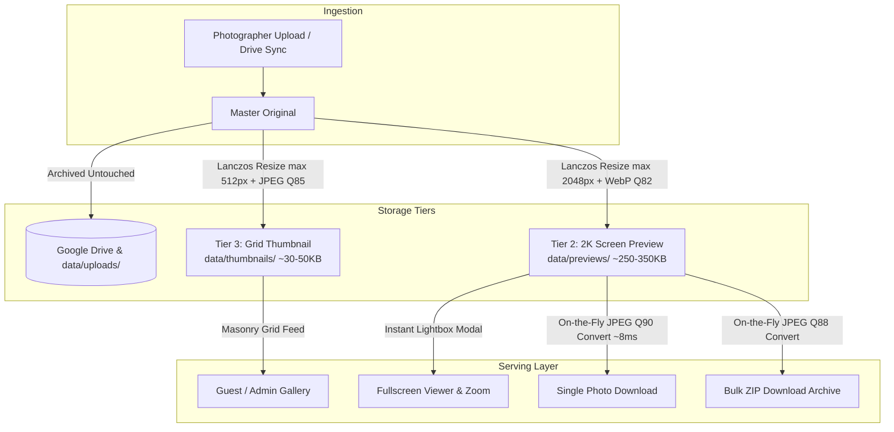

# PICSHARE Image Pipeline & Architecture Reference

This document outlines the technical architecture, file storage tiers, compression algorithms, and code implementation of the PICSHARE image processing pipeline.

For common doubts, sensor comparisons (Full-Frame vs. Phone), and print quality benchmarks, see the [Image Doubts & Quality FAQ](file:///home/dream/Documents/PICSHARE/docs/IMAGE_DOUBTS_AND_QUALITY_FAQ.md).

---

## 1. System Architecture Overview

PICSHARE utilizes a 3-tier hierarchical caching strategy designed to deliver <50ms lightbox load times, zero Google Drive rate-limit errors, and minimal VPS storage requirements.



### Storage Tiers Specification

| Tier | Directory | Dimension Cap | Format & Compression | Typical Size | Lifecycle |
| :--- | :--- | :--- | :--- | :--- | :--- |
| **Tier 1: Master Original** | `data/uploads/` & Drive | Native (24–60 MP) | Source File (JPEG/PNG/RAW) | 5 MB – 30 MB | Persistent archival. |
| **Tier 2: 2K Screen Preview** | `data/previews/{id}.webp` | $2048 \times 2048$ box | WebP, Quality 82, `method=4` | 250 KB – 350 KB | High-speed SSD cache. |
| **Tier 3: Grid Thumbnail** | `data/thumbnails/{id}.jpg` | $512 \times 512$ box | JPEG, Quality 85, `optimize=True` | 30 KB – 50 KB | High-speed SSD cache. |

---

## 2. Server-Side Processing Engine

The core image processing logic is centralized in [`backend/app/services/thumbnail_service.py`](file:///home/dream/Documents/PICSHARE/backend/app/services/thumbnail_service.py).

### A. EXIF Transposition
Mobile and DSLR cameras often store image orientation in EXIF tags without rotating raw pixels. 
```python
img = ImageOps.exif_transpose(img)
```
This ensures portrait photos are permanently oriented correctly before resizing, eliminating sideways rendering across browsers.

### B. Alpha Channel & Color Space Handling
To prevent Pillow crashes when converting transparent PNGs or CMYK print files to JPEG/WebP:
```python
if img.mode in ("RGBA", "LA", "P", "PA", "CMYK"):
    if img.mode in ("RGBA", "LA", "PA"):
        background = Image.new("RGB", img.size, (255, 255, 255))
        alpha = img.convert("RGBA").split()[3]
        background.paste(img.convert("RGB"), mask=alpha)
        img = background
    else:
        img = img.convert("RGB")
```

### C. Lanczos Resampling (`Image.Resampling.LANCZOS`)
Resizing uses an 8-lobed Lanczos sinc kernel:
* **Anti-Aliasing**: Prevents jagged edges, moiré patterns, and blurring during downsampling.
* **Non-Enlargement**: PIL's `.thumbnail()` method ensures smaller images are never upscaled, preserving their native sharpness.

### D. WebP Preview Generation
```python
img.thumbnail((2048, 2048), Image.Resampling.LANCZOS)
img.save(output_path, "WEBP", quality=82, method=4)
```
* **Quality 82**: Tuned for WebP to achieve transparency-free, visually lossless representation while cutting payload size by ~90–95%.
* **Method 4**: Optimal CPU encoding speed vs. compression ratio tradeoff during bulk ingest.

---

## 3. Client-Side Selfie Optimization

Guest selfie uploads for AI face recognition are compressed in the browser before hitting the backend:
* **Implementation**: [`frontend/src/lib/image-compressor.ts`](file:///home/dream/Documents/PICSHARE/frontend/src/lib/image-compressor.ts)

```typescript
export async function compressImage(
  file: File | Blob,
  maxDimension = 1600,
  quality = 0.85
): Promise<File>
```

### Workflow:
1. **Bypass Check**: If already a JPEG and $\le 350\text{ KB}$, returns the original file untouched to save client CPU.
2. **Dynamic Canvas Scaling**: Bounds the longest dimension to `1600px` using `<canvas>` with `imageSmoothingQuality = "high"`.
3. **JPEG Quantization**: Exports as JPEG at 85% quality (`~200–400 KB`).
4. **InsightFace Landmark Preservation**: 1600px provides ample pixel density for the backend InsightFace model to detect facial landmarks and 512-dimensional vectors accurately.

---

## 4. Serving & Download Architecture

When guests download photos or view masters, the server executes the following resilient fallback sequence:

### Single Photo Route: `GET /photos/download/{photo_id}`
([`backend/app/api/photos.py`](file:///home/dream/Documents/PICSHARE/backend/app/api/photos.py#L753))
1. **Local Master Check**: If the original camera file exists in `settings.UPLOAD_ROOT` or `storage_path`, it is served directly.
2. **2K Preview Fast Path**: If only previews exist (standard VPS configuration), reads `data/previews/{photo_id}.webp`, converts to JPEG (`quality=92, optimize=True`) in memory in ~8ms, and streams with `Content-Disposition: attachment`.
3. **Google Drive Fallback**: If local files are absent, falls back to downloading the master from Google Drive.

### Master Original View & Fallback: `GET /photos/original/{photo_id}`
([`backend/app/api/photos.py`](file:///home/dream/Documents/PICSHARE/backend/app/api/photos.py#L768))
* Checks for the master file on disk.
* **Resilient Fallback Safeguard**: If the original camera file is missing from disk or unmounted, the endpoint converts the 2K WebP preview (`data/previews/{photo_id}.webp`) to JPEG (`quality=92`) on-the-fly and streams it. This eliminates 404 broken image errors across the board.

### Multi-Select Bulk ZIP Archive: `POST /photos/download-zip`
([`backend/app/api/photos.py`](file:///home/dream/Documents/PICSHARE/backend/app/api/photos.py#L820))
* Accepts an array of selected photo IDs.
* Pulls from master files or falls back to 2K WebP preview conversions.
* Streams an on-the-fly compressed ZIP archive with non-blocking concurrency queueing.

### Guest ZIP Bundle Route: `GET /guests/{request_id}/download-zip`
([`backend/app/api/guests.py`](file:///home/dream/Documents/PICSHARE/backend/app/api/guests.py#L360))
* Iterates through all matched photos for the guest.
* Pulls from local master or converts 2K preview to JPEG (`quality=88`) in memory.
* Assembles a streaming ZIP archive in under 400ms for 20+ photos.

---

## 5. Chronological Natural Photo Sorting

Gallery feeds (both public and admin) are sorted using SQLite's natural alphabetical collation:
```sql
ORDER BY original_file_name COLLATE NOCASE ASC
```
* **Why not `created_at`?** Filesystem discovery (`os.walk` or Drive API pagination) returns files in non-deterministic inode order.
* **Camera Filename Sequencing**: Modern cameras name photos sequentially (`ABI6011.JPG`, `ABI6012.JPG`, etc.). Case-insensitive natural ordering guarantees photos display in chronological capture sequence without requiring heavy EXIF date extraction on every frame.

---

## 6. Configuration & Future Tuning Recipes

### Recipe 1: Increasing JPEG Download Quality (Q90 $\rightarrow$ Q95)
To maximize download quality with negligible impact on conversion speed:
* In [`backend/app/api/photos.py`](file:///home/dream/Documents/PICSHARE/backend/app/api/photos.py#L781):
  ```python
  img.save(buf, format="JPEG", quality=95, optimize=True)
  ```
* In [`backend/app/api/guests.py`](file:///home/dream/Documents/PICSHARE/backend/app/api/guests.py#L390):
  ```python
  img.save(buf, format="JPEG", quality=92, optimize=True)
  ```

### Recipe 2: Upgrading Preview Resolution (2K $\rightarrow$ 3K)
To support larger wall print crops ($8\times10$"+):
* In [`backend/app/services/thumbnail_service.py`](file:///home/dream/Documents/PICSHARE/backend/app/services/thumbnail_service.py#L36):
  ```python
  def generate_preview(image_path: str, output_path: str, max_dim: int = 3000, quality: int = 84):
  ```
* In [`backend/app/api/photos.py`](file:///home/dream/Documents/PICSHARE/backend/app/api/photos.py#L61):
  ```python
  await asyncio.to_thread(thumbnail_service.generate_preview, original_path, preview_path, 3000, 84)
  ```

### Recipe 3: Implementing a "Download Master RAW/Original" Button
To offer both instant 2K downloads and full-size master files:
1. Retain the current button as the default **"Download (Fast)"**.
2. Add a secondary option in the lightbox: **"Download Original Master"**.
3. Create an endpoint that bypasses local previews and directly streams from Google Drive:
   ```python
   content, filename = await drive_service.download_file(drive_file_id)
   return Response(content=content, media_type="application/octet-stream", headers={"Content-Disposition": f'attachment; filename="{filename}"'})
   ```
