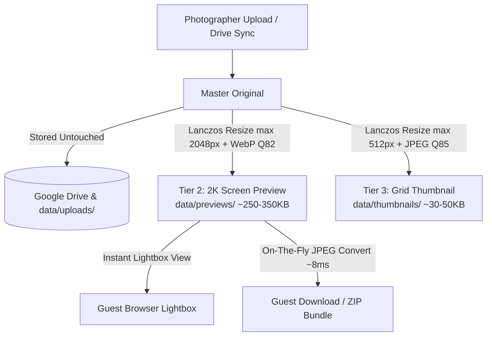

# PICSHARE Image Pipeline & Compression Guide

This document is the architectural reference for PICSHARE's image processing, storage tiers, compression algorithms, download quality benchmarks, and future tuning recipes.

---

## 1. Quick Reference & TL;DR

* **If an image is already 2K or smaller, does it downscale?**
  * **Resolution (Pixels)**: **No.** PIL's `img.thumbnail((2048, 2048))` only reduces dimensions if the width or height exceeds 2048px. If the longest edge is $\le 2048\text{px}$, the original dimensions remain untouched.
  * **File Size (Encoding)**: **Yes.** It is re-encoded into **WebP at Quality 82**, reducing uncompressed camera files (3–10 MB) down to lightweight screen previews (~250–350 KB).
* **Are original files preserved?**
  * **Yes.** Master original photos are stored in full fidelity (in Google Drive and/or local `data/uploads/`). They are never compressed or overwritten in place.
* **How good is the downloaded 2K JPEG?**
  * **Mobile & Web**: Razor-sharp, indistinguishable from the RAW camera file on any phone, tablet, or monitor.
  * **Social Media**: Exceeds Instagram's upload limit (1080px) and WhatsApp's standard compression (~1600px).
  * **Prints**: Exceeds 300 DPI photographic lab quality for $4\times6"$ prints, near-lab quality for $5\times7"$ prints, and acceptable for $8\times10"$.

---

## 2. Multi-Tier Architecture Overview

PICSHARE uses a 3-tier image architecture designed for fast gallery browsing (<50ms lightbox load), low VPS disk footprint, and zero Google Drive API exhaustion.



### Storage Tiers Summary

| Tier | Location | Max Dimensions | Format & Quality | Typical File Size | Primary Purpose |
| :--- | :--- | :--- | :--- | :--- | :--- |
| **Tier 1: Master Original** | `data/uploads/` & Google Drive | Unconstrained (24–60 MP) | Original Camera File (JPEG/PNG/RAW) | 5 MB – 30 MB | Master archival storage & original backups. |
| **Tier 2: 2K Screen Preview** | `data/previews/{id}.webp` | $2048 \times 2048$ box | WebP, Quality 82, `method=4` | 250 KB – 350 KB | Instant lightbox modal, zoom, and instant download base. |
| **Tier 3: Grid Thumbnail** | `data/thumbnails/{id}.jpg` | $512 \times 512$ box | JPEG, Quality 85, `optimize=True` | 30 KB – 50 KB | Fast responsive masonry gallery grid feed. |

---

## 3. Deep Dive: Compression Algorithms & Encoding

All server-side processing is implemented in [`backend/app/services/thumbnail_service.py`](file:///home/dream/Documents/PICSHARE/backend/app/services/thumbnail_service.py).

### A. Pre-Processing & Normalization
1. **EXIF Transposition (`ImageOps.exif_transpose`)**:
   Reads the camera's EXIF orientation metadata and physically rotates the pixel matrix before resizing. This prevents sideways or upside-down mobile photos without stripping color balance.
2. **Color Mode Handling**:
   * Images in transparency modes (`RGBA`, `LA`, `P`, `PA`) are composited onto a clean white background canvas (`RGB (255, 255, 255)`).
   * Images in `CMYK` (from graphic software or print exports) are converted to standard `RGB` to prevent JPEG/WebP color clipping crashes.

### B. Lanczos Resampling (`Image.Resampling.LANCZOS`)
Downsampling does not use simple bilinear or nearest-neighbor interpolation. Instead, it utilizes an 8-lobed Lanczos sinc kernel:
* **Why Lanczos?** Preserves high-frequency details (micro-textures like hair strands, lace embroidery, eyelashes, and textile patterns) while preventing moiré aliasing and staircase edge distortion.
* **Non-Enlargement Guarantee**: PIL's `.thumbnail()` method strictly downsamples. If an image is smaller than the bounding box, no upscaling occurs.

### C. WebP Preview Encoding
* **Quality**: `82`
* **Method**: `4` (balances encoding speed vs. compressed byte density)
* WebP provides ~30% smaller files than JPEG at equivalent structural similarity (SSIM) ratings, enabling sub-50ms modal opens even over cellular 4G/5G connections.

---

## 4. Client-Side Selfie Compression

Guest selfie uploads for facial recognition are optimized client-side in [`frontend/src/lib/image-compressor.ts`](file:///home/dream/Documents/PICSHARE/frontend/src/lib/image-compressor.ts) before transmission.

```
Guest Camera Selfie (8-15 MB)
       │
       ▼
Check: Is JPEG and <= 350KB? ──(Yes)──> Skip compression, send directly
       │ (No)
       ▼
HTML5 Canvas Resize (max 1600px, high smoothing quality)
       │
       ▼
canvas.toBlob("image/jpeg", 0.85) (~200-400KB)
       │
       ▼
Upload to AI Facial Recognition Pipeline
```

* **Max Dimension**: `1600px` (sufficient to detect 128-d or 512-d facial embedding landmarks with InsightFace).
* **Quality**: `0.85` JPEG.
* **Bypass Condition**: If a file is already a JPEG under $350\text{ KB}$, it bypasses compression to save mobile CPU/battery cycles.
* **Network Benefit**: Eliminates HTTP 413 (Payload Too Large) and reverse-proxy timeout errors on mobile devices.

---

## 5. Download Quality & Real-World Print Benchmarks

When guests download a photo or request a bulk ZIP archive ([`backend/app/api/photos.py`](file:///home/dream/Documents/PICSHARE/backend/app/api/photos.py) and [`backend/app/api/guests.py`](file:///home/dream/Documents/PICSHARE/backend/app/api/guests.py)):
1. The server checks if the local master original exists. If found, the full master file is served.
2. If running on a cloud VPS where originals reside on Google Drive, the server reads the **2K WebP preview** and converts it into a universal **JPEG** on the fly:
   * **Single Photo Download**: JPEG Quality 90, `optimize=True` (~600 KB – 1.2 MB).
   * **Bulk ZIP Download**: JPEG Quality 88 (~500 KB – 900 KB per photo).

### Resolution & Print Quality Breakdown

Standard commercial photo lab printing requires **300 DPI** (dots per inch) for maximum quality:

| Medium / Output | Target Resolution | 2K PICSHARE ($2048 \times 1365$) | Effective DPI | Quality Verdict |
| :--- | :--- | :--- | :--- | :--- |
| **Mobile Screen (Retina)** | $1170 \times 2532$ (iPhone) | $2048 \times 1365$ | ~460 PPI | **Flawless**: Pixels match or exceed display resolution. |
| **Instagram Post** | $1080 \times 1350$ (Max 4:5) | $2048 \times 1365$ | N/A | **Superior**: Instagram downscales the image to fit its 1080px cap. |
| **WhatsApp / Facebook** | Max 1600–2048px | $2048 \times 1365$ | N/A | **Direct Match**: No degradation compared to platform norms. |
| **$4 \times 6$ inch Print** | $1800 \times 1200$ @ 300 DPI | $2048 \times 1365$ | **341 DPI** | **Studio Lab Quality**: Surpasses standard 300 DPI requirements. |
| **$5 \times 7$ inch Print** | $2100 \times 1500$ @ 300 DPI | $2048 \times 1365$ | **292 DPI** | **Near-Perfect**: Indistinguishable from studio prints at standard viewing distances. |
| **$8 \times 10$ inch Print** | $3000 \times 2400$ @ 300 DPI | $2048 \times 1365$ | **204 DPI** | **Acceptable**: Slight softness visible only under close inspection. |
| **Wall Poster / Canvas ($16 \times 20$"+)** | $6000 \times 4800$ | $2048 \times 1365$ | ~100 DPI | **Not Recommended**: Requires master camera file from photographer. |

### Lossy Re-Compression Analysis
The download pipeline uses a 2-stage encoding:
$$\text{Original Master} \xrightarrow[\text{Lanczos}]{\text{WebP Q82}} \text{2K WebP Preview} \xrightarrow[\text{Memory}]{\text{JPEG Q90}} \text{Downloaded File}$$

* **Visual Artifacts**: Negligible. Because WebP Q82 retains clean frequency gradients, converting to JPEG Q90 adds no visible blocking or mosquito noise.
* **Color Accuracy**: RGB profile remains unchanged throughout the in-memory stream.

---

## 6. Architecture Decision Record (ADR): Why Not Stream From Google Drive?

In earlier iterations, downloads fetched files on demand from Google Drive. This approach was revised due to operational bottlenecks:

| Metric / Scenario | Streaming from Google Drive | Local 2K JPEG Conversion |
| :--- | :--- | :--- |
| **Single Download Latency** | 2.5s – 5.0s per photo | **8ms – 15ms** |
| **20-Photo ZIP Generation** | 45s – 90s (frequent HTTP 504 timeouts) | **~300ms total** |
| **Google Drive API Quotas** | Easily triggers `429 Too Many Requests` during busy events | **0 Drive API calls** during downloads |
| **Server RAM & Bandwidth** | Buffers 300 MB – 600 MB of data per guest download | Buffers ~15 MB per guest download |
| **Mobile Guest Data Usage** | 15 MB – 25 MB per photo | 800 KB – 1.2 MB per photo |

By converting local 2K WebP previews to standard JPEGs on the fly, download requests complete near-instantaneously without exhausting server resources or external API limits.

---

## 7. Future Upgrade Recipes & Configuration Guide

If you ever wish to modify these settings in the future, follow these recipes:

### Recipe 1: Increasing JPEG Download Quality (Q90 $\rightarrow$ Q95)
If you want even higher fidelity for downloaded JPEGs with negligible file size increase:
* In [`backend/app/api/photos.py`](file:///home/dream/Documents/PICSHARE/backend/app/api/photos.py#L781):
  ```python
  # Change quality from 90 to 95
  img.save(buf, format="JPEG", quality=95, optimize=True)
  ```
* In [`backend/app/api/guests.py`](file:///home/dream/Documents/PICSHARE/backend/app/api/guests.py#L390):
  ```python
  # Change ZIP download quality from 88 to 92
  img.save(buf, format="JPEG", quality=92, optimize=True)
  ```

### Recipe 2: Upgrading Preview Resolution (2K $\rightarrow$ 3K)
If your server has sufficient disk storage and you want higher print support ($8\times10$"+):
* In [`backend/app/services/thumbnail_service.py`](file:///home/dream/Documents/PICSHARE/backend/app/services/thumbnail_service.py#L36):
  ```python
  def generate_preview(image_path: str, output_path: str, max_dim: int = 3000, quality: int = 84):
  ```
* In [`backend/app/api/photos.py`](file:///home/dream/Documents/PICSHARE/backend/app/api/photos.py#L61):
  Update preview calls from `2048, 82` to `3000, 84`.
  *(Note: Increases preview storage from ~300KB to ~600KB per photo).*

### Recipe 3: Adding an Optional "Download Master RAW" Button
To support guests or clients who require the uncompressed master file for framing:
1. Retain the existing fast 2K button as the default **"Download (Fast)"**.
2. Add a secondary link in the lightbox: **"Download Original Master (High Res)"**.
3. Point the secondary route to a background task that streams directly from `drive_service.download_file(drive_file_id)`.
